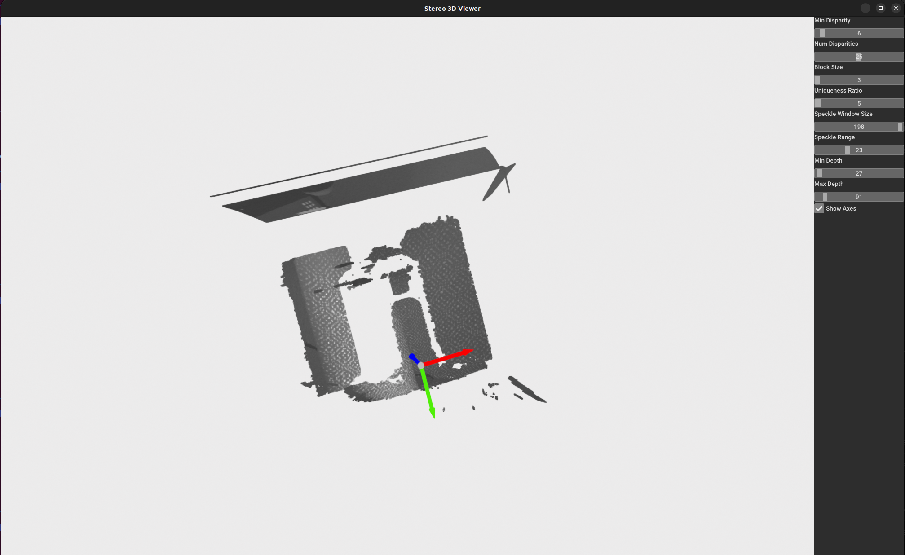

# Stereo 3D Viewer

This project provides a GUI-based 3D viewer for displaying a stereo point cloud. The main purpose is to rectify stereo images, compute the disparity map, and then reproject the disparity into a 3D point cloud that can be visualized interactively. The GUI includes sliders for adjusting stereo matching and depth parameters to observe their impact on the 3D reconstruction in real-time.

## Features
- Stereo rectification and disparity computation.
- Interactive GUI using Open3D for visualization.
- Adjustable parameters for stereo matching, such as block size, number of disparities, uniqueness ratio, etc.
- Filter points based on adjustable minimum and maximum depth.
- Toggleable axes display for orientation.

## Dependencies
You can install the required dependencies using:
```sh
pip install numpy opencv-python open3d
```

## Running the Code
To run the project, you need stereo images named `left_0.png` and `right_0.png` in an `images/` directory. You can execute the following command to start the viewer:

```sh
python3 points_cloud_using_StereoSGBM.py
```

This will launch an interactive window where you can modify parameters and see their effect on the generated 3D point cloud.

## GUI Elements
- **3D Viewer**: Displays the generated point cloud.
- **Sliders**: Adjust various parameters for disparity calculation and depth filtering:
  - **Min Disparity**: Minimum disparity used for SGBM.
  - **Num Disparities**: Controls the range of disparities used for the matching process.
  - **Block Size**: Size of the block used for matching.
  - **Uniqueness Ratio**: Uniqueness check ratio for validating disparity matches.
  - **Speckle Window Size** and **Speckle Range**: Used for filtering out small speckles in the disparity map.
  - **Min Depth** and **Max Depth**: Control the range of depth values displayed in the point cloud.



## How It Works
1. **Stereo Rectification**: The left and right images are rectified to align corresponding rows, which makes the disparity computation more straightforward.
2. **Disparity Computation**: Disparity is computed using the Semi-Global Block Matching (SGBM) algorithm.
3. **Point Cloud Generation**: The disparity map is used to reproject points into 3D space. Color information from the left image is used to colorize the point cloud.
4. **Interactive Visualization**: The generated point cloud is displayed using Open3D, and you can adjust various parameters interactively.